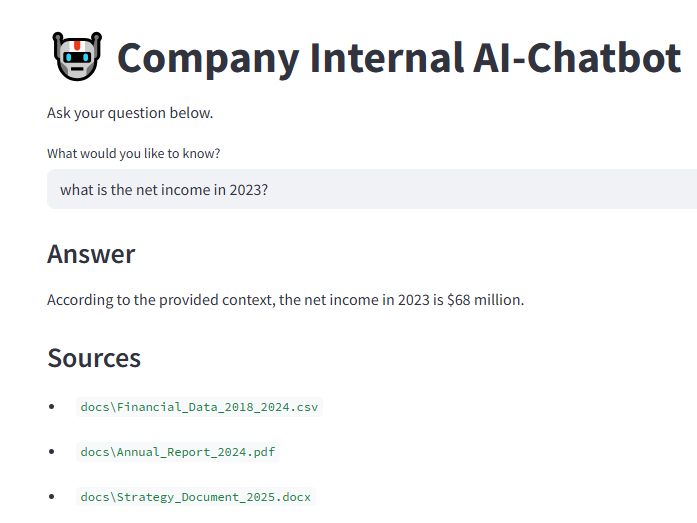

# 🤖 Business Report Chatbot

A local RAG-based chatbot that answers questions based on your own company documents — including PDFs, Word files, text, and CSVs.

##  Tech Stack

```txt
 LangChain         - Document chunking, embedding, RAG chaining
 Ollama            - Local language model (e.g. LLaMA 3)
 FAISS             - Vector similarity search
 Streamlit         - Simple UI for chatting
 langchain-community - Document loaders (PDF, DOCX, CSV, etc.)
 pandas            - CSV handling and display
 docx2txt / PyPDF2 - File parsing

---




---

##  Features

- Load PDF, DOCX, TXT, and CSV files from the `docs/` folder
- Asks questions in natural language
- Fast and private — all models run locally
- Easy to extend with file upload or memory


